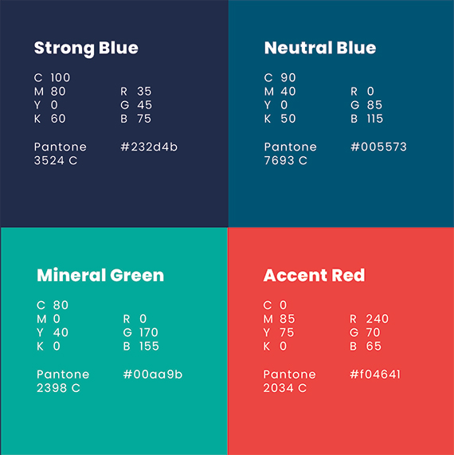

# inetum-bootstrap

[inetum.world](https://inetum.world) bootstrap theme.

## Examples

See [https://inetum.github.io/inetum-bootstrap](https://inetum.github.io/inetum-bootstrap) for some live examples 

## Usage

### CSS

You can directly download the css from [dist/css](dist/css)

### CDN

Use [jsdelivr > inetum > inetum-bootstrap](https://www.jsdelivr.com/package/gh/inetum/inetum-bootstrap?path=dist%2Fcss)

    <link rel="stylesheet" href="https://cdn.jsdelivr.net/gh/inetum/inetum-bootstrap@4.5.3-rc3/dist/css/inetum.min.css" integrity="sha256-DZT1SObUN+nrHEXc3rdVOhcvqfTcUbORHyEEv+THSYg=" crossorigin="anonymous">
    

### Sass

To use or extend sass in your project.

Install:

    npm install --save @inetum/inetum-bootstrap@latest

Import inetum scss:

    @import '~@inetum/inetum-bootstrap/scss/inetum';

For more information on how to extend, follow bootstrap tutorials: [importing-precompiled-sass](https://getbootstrap.com/docs/4.5/getting-started/webpack/#importing-precompiled-sass)

#### Colors

Specific colors define in [inetum.scss](scss/inetum.scss) are:

    $strong-blue: #232d4b;
    $neutral-blue: #005573;
    $mineral-green: #00aa9b;
    $accent-red: #dc3545;

## Compatibility

Version follow bootstrap versioning + an additional pre-release identifier as describe in [Semantic Versioning](https://semver.org/#spec-item-9)

| inetnum-bootstrap | bootstrap     |
|:-----------------:| ------------- |
| 4.5.3-rc1         | ^4.5.3        |
| 4.5.3-rc2         | ^4.5.3        |
| 4.5.3-rc3         | ^4.5.3        |

## Credits

Inspired from:
- https://bootswatch.com/
- https://pikock.github.io/bootstrap-magic/
